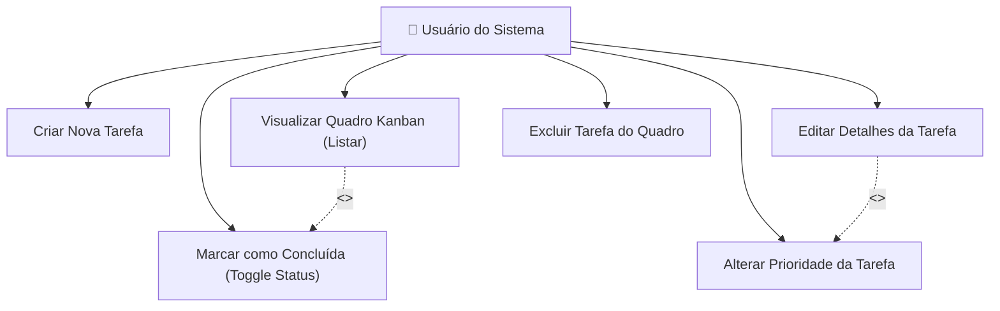

# Diagrama de Casos de Uso UML

Este diagrama de casos de uso descreve o comportamento do sistema a partir do ponto de vista do usuário final (Desenvolvedor/Membro da Equipe Ágil), mostrando como ele interage com as funcionalidades de gerenciamento de tarefas.

## Representação Visual (Mermaid)

## Descrição Detalhada dos Casos de Uso

### 1. Criar Nova Tarefa (UC1)
*   **Ator Principal**: Usuário do Sistema.
*   **Pré-condições**: Nenhuma.
*   **Fluxo Principal**:
    1. O usuário clica em "+ Nova Tarefa".
    2. O sistema exibe um formulário de preenchimento.
    3. O usuário digita o título (obrigatório), a descrição, escolhe a prioridade e o status inicial.
    4. O usuário clica em "Salvar".
    5. O sistema valida os campos, insere no banco de dados SQLite e redireciona ao Quadro Kanban com mensagem de sucesso.

### 2. Visualizar Quadro Kanban (UC2)
*   **Ator Principal**: Usuário do Sistema.
*   **Fluxo Principal**:
    1. O usuário acessa a página inicial do sistema.
    2. O sistema busca todas as tarefas salvas.
    3. As tarefas são distribuídas automaticamente em três colunas baseadas em seu status: "A Fazer", "Em Progresso" e "Concluído".
    4. Cada tarefa mostra seu título, descrição curta, badge de prioridade colorida e data de inserção.

### 3. Editar Detalhes da Tarefa (UC3)
*   **Ator Principal**: Usuário do Sistema.
*   **Fluxo Principal**:
    1. O usuário clica no ícone de edição (✏️) no card de uma tarefa específica.
    2. O sistema carrega o formulário pré-preenchido com os dados atuais da tarefa.
    3. O usuário altera os dados desejados e clica em "Atualizar Tarefa".
    4. O sistema atualiza o banco de dados e exibe o painel com as novas alterações.

### 4. Alterar Prioridade da Tarefa (UC4 - Extensão de UC3)
*   **Ator Principal**: Usuário do Sistema.
*   **Notas**: É a funcionalidade adicionada via **Mudança de Escopo**. Permite selecionar entre os níveis `Baixa`, `Média` ou `Alta` na edição ou criação para facilitar o triagem e sequenciamento de atividades urgentes da sprint.

### 5. Excluir Tarefa do Quadro (UC5)
*   **Ator Principal**: Usuário do Sistema.
*   **Fluxo Principal**:
    1. O usuário clica no ícone de lixeira (🗑️) em uma tarefa.
    2. Uma caixa de diálogo de confirmação em Javascript (pop-up) é exibida para segurança.
    3. O usuário confirma a exclusão.
    4. O sistema executa o comando `DELETE` no SQLite e atualiza o Kanban sem a tarefa excluída.

### 6. Marcar como Concluída (UC6)
*   **Ator Principal**: Usuário do Sistema.
*   **Fluxo Principal**:
    1. O usuário clica no botão "Marcar Concluída" (para tarefas pendentes) ou "Concluída (Reabrir)" (para tarefas já finalizadas).
    2. O sistema altera o status da tarefa no SQLite entre os estados "A Fazer" e "Concluído".
    3. O card é reposicionado na coluna correspondente instantaneamente após o carregamento da página.
