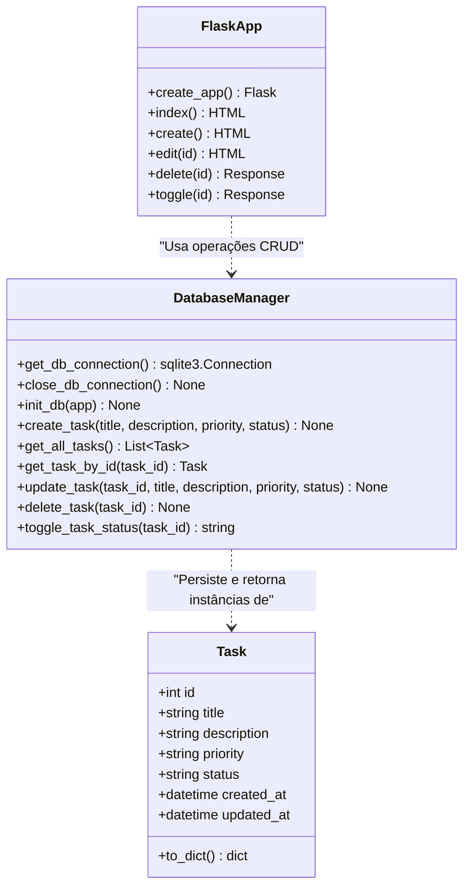

# Diagrama de Classes UML

Este diagrama de classes representa o modelo estrutural do sistema de gerenciamento de tarefas (KanbanTasker). Ele ilustra as classes, seus atributos, métodos e os relacionamentos de dependência.

## Representação Visual (Mermaid)

## Detalhamento das Classes

### 1. Classe `Task` (Entidade / Registro de Tabela)
Representa o modelo conceitual de uma tarefa armazenada na tabela `tasks` do banco de dados SQLite.
*   `id` (Chave Primária): Identificador único numérico gerado automaticamente.
*   `title` (String): Título resumido da tarefa (obrigatório).
*   `description` (String): Detalhes específicos ou critérios de aceitação (opcional).
*   `priority` (Enum/String): Nível de urgência da tarefa (`Alta`, `Média`, `Baixa`).
*   `status` (Enum/String): Coluna atual do quadro Kanban (`A Fazer`, `Em Progresso`, `Concluído`).
*   `created_at` / `updated_at` (Timestamp): Timestamps automáticos de auditoria.

### 2. Classe Estática `DatabaseManager` (Persistência / `src/database.py`)
Encapsula o acesso a conexões e transações SQL nativas no banco SQLite local.
*   `init_db()`: Lê e executa o script `schema.sql` para criar a base inicial.
*   `create_task()`: Executa uma query `INSERT` parametrizada para evitar SQL Injection.
*   `get_all_tasks()`: Retorna um conjunto de linhas mapeadas (equivalente a uma lista de dicionários) com ordenação cronológica decrescente.
*   `toggle_task_status()`: Contém a regra de negócio que inverte o status de uma tarefa rapidamente.

### 3. Classe / Controlador `FlaskApp` (Rotas / `src/app.py`)
Gerencia o fluxo de controle de navegação e as requisições HTTP (GET/POST) do usuário.
*   Injetada com o padrão Factory `create_app()` para isolamento de ambiente.
*   Dispara alertas do tipo `Flash` para notificar o usuário sobre os resultados das operações.
